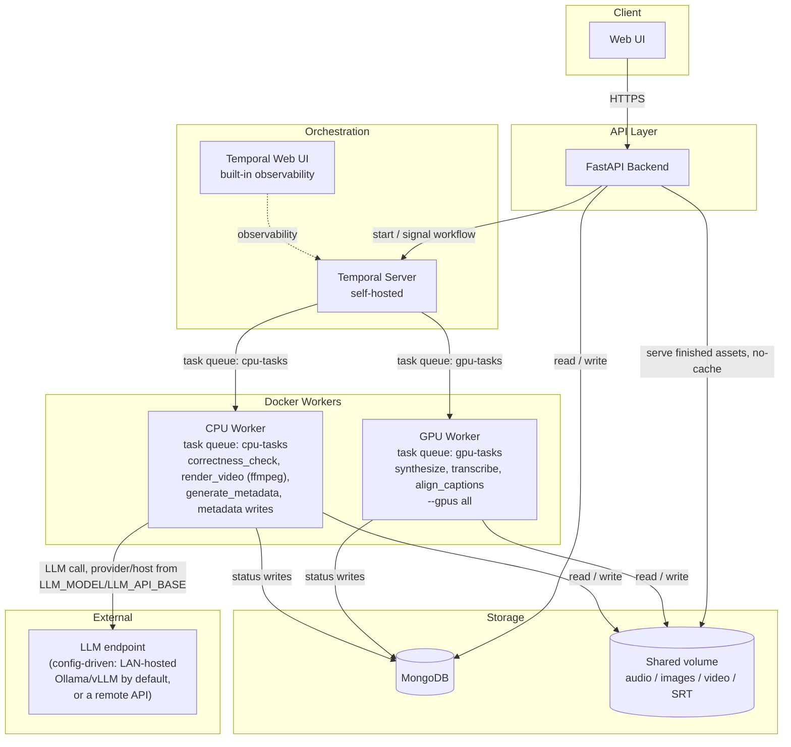
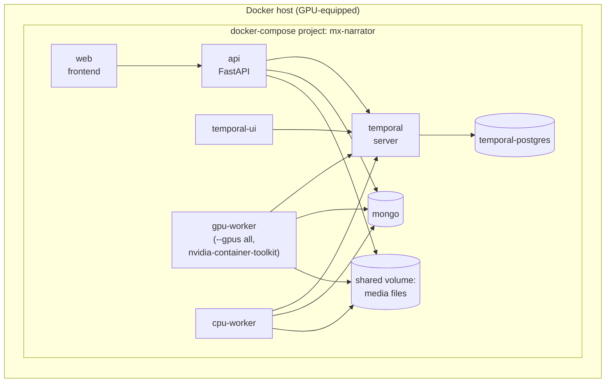
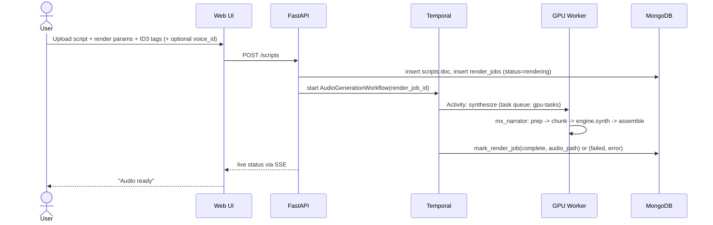
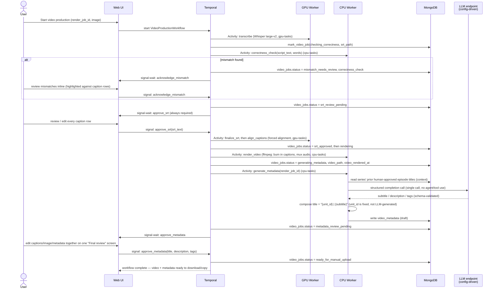
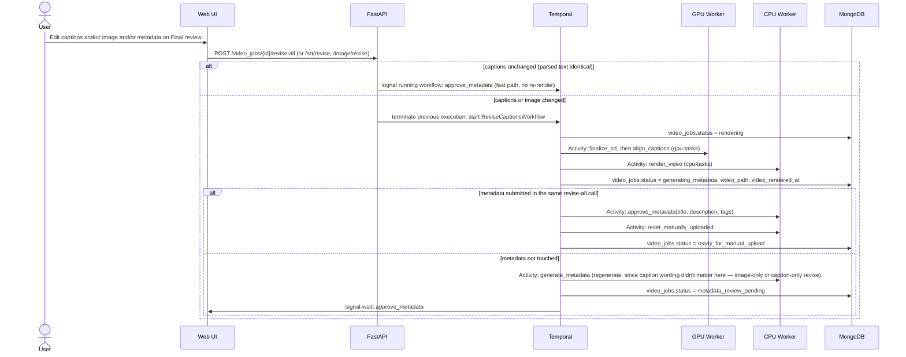
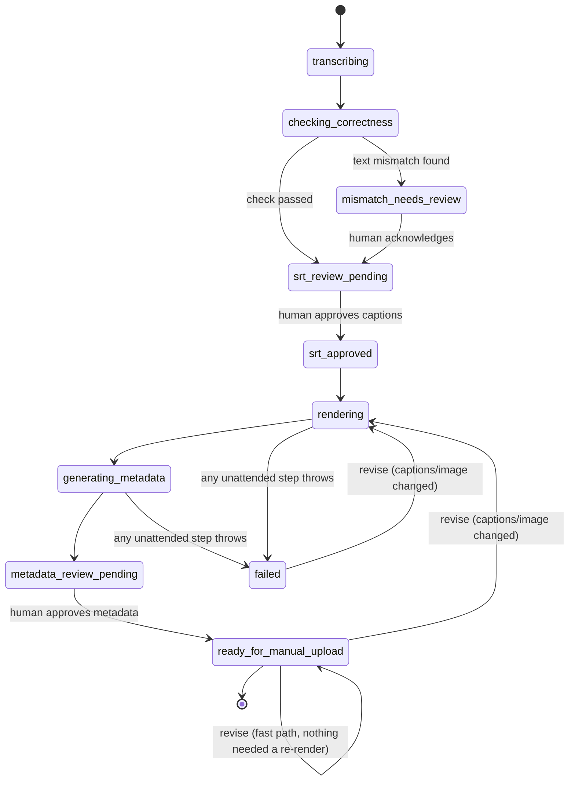

# Mx Narrator Studio — Script-to-Video Production Pipeline

**Status:** Living document — describes the system as actually built and currently
running, not a proposal awaiting implementation. Originally written as a
pre-implementation RFC (v1–v5, decision log preserved in §12); converted to this
format once the system had grown well past what that log could track accurately.
Update this document whenever a change alters the architecture, data model, workflow
shape, or a still-open decision — not for every code change, but whenever a future
reader would otherwise be misled by it.
**Author:** Claude, for Giovanni Fajardo (gffajardo@gmail.com)
**Scope:** Web UI + Temporal workflows + MongoDB + Docker workers, orchestrating the
`mx_narrator` CLI/library (`src/mx_narrator/`) that ships in the same repository

---

## 1. Summary

`mx_narrator` is a local CLI: script in, narrated MP3 out, with real voice cloning
(Chatterbox), correct multilingual scripture/number handling, and ID3 tagging. This
system wraps it in a small internal platform: a script upload turns into a fully-tagged
MP3, then — after transcription, an automated correctness check, and human caption
review — a captioned video, then a title/description/tags draft (the title built from
the episode's own human-authored name plus an LLM-written subtitle; description and
tags fully LLM-generated), staged in the UI for the user to upload to YouTube
themselves. A human approves every consequential step
along the way. The system never touches YouTube directly; it stops at "everything is
ready for you to publish." Runs as self-hosted Docker services orchestrated by Temporal.

## 2. Motivation

Producing one episode by hand means manually running CLI commands, hand-tracking which
unit/language/render-parameters were used, and manually handling transcription and video
assembly. That doesn't scale to a weekly multi-part series across three languages. This
system turns that into: upload once, get notified when each human-decision point is
ready, approve, move on — ending with a finished video and copy-paste-ready metadata,
the same hand-off point the manual process had, just automated up to that point.

## 3. Goals

- Web-based script upload with full ID3 tag control and per-voice, per-language voice
  management (upload/replace/delete reference samples independently per language).
- Durable, observable, resumable pipeline execution (Temporal) surviving worker restarts
  and GPU contention.
- A correctness check that catches TTS content problems (skipped/repeated speech) by
  comparing Whisper's transcript against the exact text `mx_narrator` fed to synthesis,
  with mismatches surfaced inline against the caption editor rather than as a separate
  list the reviewer has to cross-reference by timestamp.
- Forced word-level alignment of the human-approved caption text against the actual
  audio, so caption timing tracks the real speech rather than only Whisper's own
  (occasionally drifty) segment boundaries.
- Burned-in captions on the final video — legible everywhere the video is played,
  independent of player caption support (see §10 for why this replaced the original
  soft-subtitle-track design).
- A single "Final review" screen showing the rendered video, the editable caption text,
  and the editable metadata fields together, rather than splitting them across
  screens or hiding them behind collapsed sections.
- The ability to revise captions, the background image, or metadata *after* a job has
  already reached final review (or failed) — without re-running transcription or the
  correctness check, since a human edit at that point already *is* the correction. Once
  a job is fully `ready_for_manual_upload`, metadata specifically can also be
  regenerated and re-saved in place, independent of captions/image.
- YouTube title/description/tags staged for manual copy-paste — **the system never
  uploads or publishes anything itself.** The title's main part is always the episode's
  own human-authored name, not LLM-invented; only its appended subtitle, the
  description, and the tags are LLM-generated.
- Self-hosted on the user's own Docker-capable, GPU-equipped hardware — no new recurring
  cloud costs. Metadata generation defaults to LLM inference on the user's own home
  network (Ollama/vLLM on any of several LAN machines the user already has), so no data
  needs to leave the network at all by default; a remote API (e.g. Anthropic) remains an
  explicit, config-driven opt-in for when local copy quality proves insufficient.

## 4. Non-Goals

- **Authentication / multi-tenancy** — there is no login, no `users` collection, no
  session/JWT layer. Earlier drafts of this document specified one; it was never built,
  because the actual deployment is one person's tool on their own home network, not a
  shared service. The API is reachable to anything that can reach the host — treat the
  network boundary (§9) as the only access control that exists. Revisit only if this
  ever needs to be reachable by more than one trusted person.
- **Any YouTube API integration** — no OAuth, no upload, no publish, no scheduling. This
  was explicitly considered and reversed early on: the system's job ends at producing
  the finished video and metadata; the actual upload is a manual, off-system action.
- Rewriting `mx_narrator`'s synthesis internals — `src/mx_narrator/` is treated as a
  stable, already-hardened dependency this system calls into.
- Analytics/growth tooling, comment management, or anything past "assets are ready."

## 5. System Architecture

### 5.1 Component diagram

No component ever talks to YouTube. The workflow's terminal state is "assets ready" —
the UI's job past that point is just letting the user download/copy what's there, or
revise it. The "External" subgraph is a soft label, not a hard architectural boundary —
by default the LLM endpoint is another machine on the user's own home network (still
"internal" in every practical sense), not a third party; it only becomes truly external
when `LLM_MODEL` is explicitly configured to point at a remote API instead.

`render_video` (ffmpeg) runs on the CPU worker, not the GPU worker — muxing a static
image, an audio track, and burned-in subtitles has no GPU-accelerated step in this
pipeline (see §10), so it shares the lightweight worker with metadata generation rather
than contending with synthesis/transcription for GPU time.

### 5.2 Deployment topology (Docker Compose)

Each worker type is its own Docker image/service so the GPU-bound one (needing
`nvidia-container-toolkit`) doesn't force GPU requirements onto the lightweight metadata
worker, and so task queues can scale independently. `api` and `cpu-worker` both reuse
the `gpu-worker` image (same monorepo, same `uv.lock`) rather than paying for a second
multi-hundred-second ML-stack build for services that don't need it — they just run a
different command against the same image. No publish worker exists — there's nothing
for it to do.

The compose project is named `mx-narrator` (renamed from `narrator-studio`; see §12),
but the named volumes and the `MONGODB_DATABASE` value were deliberately **not**
renamed alongside it — they still point at `narrator-studio_*`/`narrator_studio` so the
rename doesn't strand or migrate real production data. Both are config, not hardcoded,
so a future clean rename remains possible without a code change.

## 6. Data Model

### 6.1 Entity-relationship diagram

```mermaid
erDiagram
    SCRIPTS ||--o{ RENDER_JOBS : generates
    VOICES ||--o{ SCRIPTS : "optionally voices"
    RENDER_JOBS ||--o{ VIDEO_JOBS : "feeds into"
    VIDEO_JOBS ||--o| VIDEO_METADATA : produces

    SCRIPTS {
        string _id PK
        string unit_id
        string lang
        string series_name
        string series_album
        string text
        object id3
        string engine_name
        float speed
        float exaggeration
        float cfg_weight
        int seed
        string voice_id FK
        datetime created_at
    }
    VOICES {
        string _id PK
        string name
        object samples "lang -> wav path"
        datetime created_at
    }
    RENDER_JOBS {
        string _id PK
        string script_id FK
        string status
        string audio_path
        string audio_url
        datetime audio_replaced_at
        string error
        datetime created_at
        datetime completed_at
    }
    VIDEO_JOBS {
        string _id PK
        string render_job_id FK
        string active_workflow_id
        string image_path
        string audio_url
        string srt_path
        object correctness_check
        string status
        string video_path
        string video_url
        datetime video_rendered_at
        boolean manually_uploaded
        datetime manually_uploaded_at
        string error
        datetime created_at
    }
    VIDEO_METADATA {
        string _id PK
        string render_job_id FK
        string title
        string description
        array tags
        datetime approved_at
    }
```

This has drifted from the ER shape originally proposed pre-implementation: there is no `users`
collection (no auth, §4); `scripts` stores the render parameters directly rather than
splitting them into a separate always-1:1 entity; `video_metadata` keys off
`render_job_id` (one series of metadata per render, reused across caption revisions of
the same video), not `video_job_id`. IDs throughout are plain UUID strings (`str(uuid.uuid4())`),
not `ObjectId` — chosen so the API layer, the Temporal workflow ID (`video-prod-{video_job_id}`),
and the shared-volume directory name (`{video_job_id}/`) can all use the same literal
string with no translation.

### 6.2 Collection field reference

**`scripts`**

| Field | Type | Notes |
|---|---|---|
| `_id` | string (uuid) | |
| `unit_id` | string | matches `mx_narrator`'s `<unit-id>` convention |
| `lang` | string | one of `mx_narrator.prep.registry.available_languages()` (currently `es`/`en`/`pt`) |
| `series_name` | string | groups episodes for `generate_metadata`'s prior-titles context |
| `series_album` | string | MP3 `album` ID3 default; independent of `series_name` |
| `text` | string | the script content, as `mx_narrator` expects it |
| `id3` | object | `{artist, title, album, track, year, genre, comments}` |
| `engine_name`, `speed`, `exaggeration`, `cfg_weight`, `seed` | — | passed straight through to synthesis |
| `voice_id` | string \| null | references a `voices` document; null means the engine's built-in default |
| `created_at` | datetime | |

**`voices`** — user-managed reference voices, independent of any one script

| Field | Type | Notes |
|---|---|---|
| `_id` | string (uuid) | |
| `name` | string | |
| `samples` | object | `{lang: wav_path}` — one reference sample per language, addable/replaceable/deletable independently |
| `created_at` | datetime | |

**`render_jobs`** — one per script render attempt (`AudioGenerationWorkflow`)

| Field | Type | Notes |
|---|---|---|
| `_id` | string (uuid), also the Temporal workflow ID's key | |
| `script_id` | string → `scripts` | |
| `status` | string | `queued` \| `rendering` \| `complete` \| `failed` |
| `audio_path`, `audio_url` | string | shared-volume path and its `/media/...` URL |
| `audio_replaced_at` | datetime | set only when the audio was manually replaced post-completion (§8.4) — drives client-side cache-busting |
| `error` | string | present only when `status == "failed"` |
| `created_at`, `completed_at` | datetime | |

**`video_jobs`** — one per video production attempt for a `render_job`

| Field | Type | Notes |
|---|---|---|
| `_id` | string (uuid) | also the suffix of the owning Temporal workflow ID |
| `render_job_id` | string → `render_jobs` | |
| `active_workflow_id` | string | which Temporal workflow execution currently owns this job — updated when a caption revision starts a fresh `ReviseCaptionsWorkflow` execution, so signals keep reaching the right place |
| `image_path` | string | background image, shared volume |
| `audio_url` | string | copied from the render job at creation time |
| `srt_path` | string | written right after transcription, before human approval, so the review UI can pre-fill from it |
| `correctness_check` | object | `{status: "pass"\|"mismatch", mismatches: [{expected, actual, approx_time}]}` |
| `status` | string | see §7.3 state diagram |
| `video_path`, `video_url` | string | final MP4, once rendered |
| `video_rendered_at` | datetime | set every time `render_video` completes (including revisions) — drives client-side cache-busting, since the URL itself never changes |
| `manually_uploaded`, `manually_uploaded_at` | boolean, datetime | user-toggled, purely for the user's own tracking |
| `error` | string | present only when `status == "failed"` |
| `created_at` | datetime | |

**`video_metadata`** — one per render job's generated YouTube copy

| Field | Type | Notes |
|---|---|---|
| `_id` | string (uuid) | |
| `render_job_id` | string → `render_jobs` | |
| `title` | string | `"{unit_id} \| {LLM subtitle}"` — the main part is the episode's own human-authored name, not LLM-generated; human-editable before approval |
| `description` | string | LLM output, human-editable before approval |
| `tags` | array\<string\> | |
| `approved_at` | datetime | set once the human approves/edits and confirms |

No YouTube video ID, visibility, or publish-status fields — the system never uploads
anything, so there's nothing to track on YouTube's side. `manually_uploaded` exists only
so the dashboard can show "which episodes have I already put up," set by hand.

## 7. Workflows

### 7.1 `AudioGenerationWorkflow`

The Activity body is essentially `src/mx_narrator/batch.py`'s render path, called with
parameters built from the UI form fields instead of CLI args. `synthesize` runs with
`maximum_attempts=1` — a bad engine name, malformed script, or corrupt voice file fails
the same way every time, so retrying blindly would just leave the job stuck at
`rendering` instead of surfacing the failure; transient infra hiccups are handled by
Temporal's own worker-restart durability, not activity-level retry.

**Heartbeating.** `synthesize` can legitimately run for tens of minutes, so it (and
every other long, single-call Activity in this system — `transcribe`, `render_video`)
runs with a `heartbeat_timeout` of 45s, backed by a background thread that calls
`activity.heartbeat()` every 15s (`worker/activities.py`) for the duration of the
synchronous inference/ffmpeg call. Without this, Temporal has no way to distinguish "a
worker died mid-call" from "a worker is still legitimately busy" until the full
`start_to_close_timeout` (two hours, for `synthesize`) elapses — the heartbeat is what
actually surfaces a crashed GPU worker in minutes instead of hours. `align_captions` is
the one exception: a real episode aligns in ~13s warm, short enough that its own
`start_to_close_timeout` is a tight enough bound on its own, so no heartbeat thread runs
for it.

### 7.2 `VideoProductionWorkflow`

Workflow ends at metadata approval. There is no publish step, no OAuth, no upload
Activity — the user takes the finished MP4 and the approved title/description/tags from
the UI and uploads to YouTube themselves. `generate_metadata` is a single deterministic
Temporal Activity, not an agent — no tool use, no multi-step reasoning. Its title is not
LLM-generated at all: the main part is always the episode's own `unit_id`, with only a
short LLM-written subtitle appended after it (`"{unit_id} | {subtitle}"`) — see §12
Decision Log for why. Retries beyond one attempt are bounded by Temporal's `RetryPolicy`
(`maximum_attempts=5`, 30s initial backoff up to a 2-minute cap, ~5.5 minutes total) —
widened well past a single quick retry once real production failures showed a
host-specific Ollama/ROCm GPU hang needing real wall-clock time to clear, not a fast
retry (§12 Decision Log); a persistent misconfiguration or a schema-validation failure
on the LLM's own output is still deterministic and won't be rescued by retrying longer.
It pre-fetches context (prior human-approved episode titles in the same `series_name`)
before making one structured LLM call. The LLM provider and target machine are both
config-driven (`LLM_MODEL`, `LLM_API_BASE`) — defaulting to an Ollama-served model on
the deployment host itself, with a remote API (e.g. Anthropic, via `ANTHROPIC_API_KEY`)
available as an explicit opt-in override. See §10 and §12 for the technology choice and
rationale.

Any Activity failure from `render_video` onward (unattended system work: ffmpeg, an LLM
call) is caught and recorded as `video_jobs.status = "failed"` with the error message —
it does not leave the job silently stuck. Everything before that point is a human
signal-wait with no timeout of its own; `VideoProductionWorkflow` deliberately has no
workflow-level execution timeout, unlike every Activity in this codebase — it's the
first workflow that legitimately sits idle for human review timescales.

### 7.3 `ReviseCaptionsWorkflow`

A second, separate workflow, started after a video job has already reached
`metadata_review_pending`, `ready_for_manual_upload`, or `failed` — i.e., captions have
already been through review once. It re-renders the video against corrected caption
text (and optionally a new background image, and optionally new metadata) without
re-running transcription or the correctness check, since a human edit at this point
already *is* the correction.

`POST /video_jobs/{id}/revise-all` (backing the unified Final review screen, §8.3) is
the one endpoint that can touch captions, image, and metadata in a single submit. It
compares the *parsed caption text* of the new SRT against the current one — not the raw
SRT string — to decide whether a re-render is actually needed, since re-serializing
through the caption editor introduces harmless floating-point timestamp drift on every
save even with zero real edits; comparing raw strings was tried first and produced false
"needs re-render" positives. When nothing changed, it takes the fast path: signal the
still-running workflow's `approve_metadata` directly rather than tearing anything down.

`ReviseCaptionsWorkflow` needs its own `approve_metadata` signal — Temporal signals are
scoped to one running execution, so it can't reuse `VideoProductionWorkflow`'s. This
duplicates a small signal-plus-tail block rather than sharing a base class; both
workflows call the exact same Activities, so they can't drift on *what* happens, only on
orchestration order.

### 7.4 `video_jobs.status` state machine

`ready_for_manual_upload` is a terminal state, not a queue waiting on further system
action — the dashboard can optionally flip `manually_uploaded` later purely for the
user's own tracking, and a job can always be revised out of this state later, but
nothing in the workflow depends on either happening.

Getting captions right is two independent problems, solved by two independent
mechanisms, deliberately run in this order — content first, then timing, never the
reverse, so alignment is never wasted on text that's about to change:

**Content correctness** (`checking_correctness`, before any human review). The
correctness check compares **exact text** — the ground truth is the same
prepared/chunked text `mx_narrator` already fed to TTS — not a fuzzy LLM judgment: the
ground truth is fully known and deterministic, so semantic judgment would only add
cost/latency without adding accuracy. Normalization handles known sources of false
mismatches rather than flagging them as real ones: punctuation and case are stripped,
accented vowels fold to their base form (Whisper is inconsistent about reproducing
accents — but letters like `ñ`/`ç` are deliberately left unfolded, since those are
distinct letters, not accented vowels), a handful of Spanish words with two valid
one-word/two-word spellings are merged to one canonical form on both sides, and
transcribed spoken numbers are re-expanded to words (`mx_narrator`'s own prepared text
already spells numbers out; Whisper writes them back as digits) via the same
per-language `expand_numbers()` used during prep. See `worker/diff.py` for the full
normalization pipeline. Any resulting mismatch is a flag for the human to look at, not a
gate that blocks the pipeline — caption text is always human-reviewed next regardless of
whether the check passed.

**Timing sync** (`align_captions`, after `approve_srt`). Whisper's own segment
timestamps can drift from the real audio, so they aren't trusted as final. Once the
human approves the caption *text*, forced word-level alignment (`worker/align.py`) runs
that exact approved text against the real audio waveform, producing timestamps tied to
actual speech rather than to whatever Whisper guessed before the human's edits — running
it after approval, rather than before, means alignment always operates on the final,
corrected text. It's deliberately best-effort: a failed alignment degrades gracefully
back to Whisper's original segment timing rather than blocking the workflow
(`AlignCaptionsResult.aligned: bool` records which happened; nothing raises). Separately,
Whisper itself always transcribes the **final assembled** audio — the same file
synthesis produced — not individual pre-assembly chunks, so even its own timestamps
start out in sync with what the video will actually play, before alignment refines them
further.

## 8. Human-in-the-Loop Design

### 8.1 Signal-wait points

Every point below is a Temporal signal-wait:

1. **Correctness-check mismatch** — halts; human acknowledges before continuing. The
   mismatch list is shown highlighted directly against the corresponding caption rows in
   the SRT editor (not a separate list the reviewer has to cross-reference by
   timestamp), so a flagged mismatch and the text to fix it are in the same view.
2. **Caption review** — always required, regardless of correctness-check outcome; human
   reads/edits every caption row before it becomes burned-in text. Editing here is what
   *is* the correction when the automated check flagged something.
3. **Metadata review** — human edits/approves the draft title/description/tags. This
   is the workflow's last step — once approved, the video and metadata sit in the UI,
   finished, waiting for the user to manually upload to YouTube on their own time.

There is deliberately no publish-approval gate, because there is no publish action for
one to gate.

### 8.2 Final review screen

The metadata-review step and everything before it converge on a single "Final review"
screen: the rendered (or in-progress) video, the caption editor (with mismatch
highlighting if any were found), and the title/description/tags/background-image fields
are all visible together, not split across screens or hidden behind a collapsed
section. One save posts a multipart form (`srt_text`, `title`, `description`, `tags`,
optional `image`) to `revise-all`. A tabbed sub-view separates "Captions" from
"Background image" within the same screen when a revise is needed after the fact — an
earlier version used two separate collapsible toggles with links out to the raw SRT and
video, which the user found harder to work with than seeing both directly.

### 8.3 Revise after approval

Once a job reaches `ready_for_manual_upload` or `failed`, the same Final review screen
stays available and can trigger `ReviseCaptionsWorkflow` (§7.3) — for a correction
noticed after the fact, or to recover a failed render without starting over from
transcription.

At `ready_for_manual_upload` specifically, metadata can also be regenerated and
re-saved independent of captions/image, entirely outside Temporal (the owning workflow
has already completed, so there's nothing left to signal): a "Regenerate" call runs the
same `generate_metadata` logic directly and returns a preview without writing anything,
so the currently-approved metadata stays valid until a human explicitly reviews and
saves the new draft — the same "human approves every consequential step" principle
applied to a step that happens after the workflow itself is already done.

### 8.4 Replace audio

Independent of video production: on the render-job status page, once a render reaches
`complete` or `failed`, the user can upload a replacement audio file (e.g. after adding
background music externally) that becomes the canonical audio for that render job —
used by any subsequent video production or revision. This is a pure file-and-document
operation with no Temporal involvement (the `AudioGenerationWorkflow` execution has
already finished by then); it does not run ID3 tagging against the upload, since it
might not even be an MP3.

## 9. Security & Secrets

- **`LLM_MODEL`, `LLM_API_BASE`, `OLLAMA_KEEP_ALIVE`**: plain config (not secrets)
  selecting the LLM provider and target machine for metadata generation — e.g.
  `LLM_MODEL=ollama_chat/qwen3.5:9b` (not plain `ollama/...` — litellm's `ollama/`
  prefix routes through Ollama's legacy `/api/generate` handler, which silently drops
  `OLLAMA_KEEP_ALIVE` in the wrong place in the request; `ollama_chat/` handles it
  correctly) with `LLM_API_BASE=http://host.docker.internal:11434` for the deployment
  host's own Ollama instance (the current default), or `hosted_vllm/<model>` with a
  vLLM host's `/v1` endpoint for a different LAN machine. `OLLAMA_KEEP_ALIVE` (default
  `30m`) keeps the model resident longer than Ollama's own 5-minute default, reducing
  cold runner (re)starts — see §12's note on the ROCm GPU-hang mitigation.
- **`ANTHROPIC_API_KEY`**: `.env`-provided, excluded from any image build context —
  **only required when `LLM_MODEL` is explicitly configured to select a remote
  provider** (e.g. `anthropic/claude-...`). Not required, and not read, when using the
  LAN-hosted default. When it is in use, it's the system's only outbound network
  dependency to a third party.
- **Auth**: none (§4). The API and UI are exposed only on the local network — not a
  public internet-facing service. Treat reachability to the Docker host as equivalent to
  full access to the system; there is no further access control layer.
- **`MONGODB_DATABASE`**: config, not a secret — decouples the Mongo database name from
  the Docker Compose project name, specifically so a cosmetic project rename (§12) never
  implies migrating or renaming live data.

## 10. Technology Stack

| Layer | Choice | Rationale |
|---|---|---|
| Backend/API | FastAPI (Python) | `mx_narrator` is already Python; Temporal's Python SDK (`temporalio`) is first-class. |
| Frontend | React 19 + Vite, plain JavaScript (ES Modules, no TypeScript), inline CSS-in-JS with a shared color-token system | Matches the user's other trilingual Bible project — same conventions, same stack, no new tooling to learn or maintain. |
| Workflow engine | Temporal, self-hosted via Docker Compose | Durable execution + native signal/query primitives, which map directly onto "pause and wait for a human." |
| Database | MongoDB (Motor async driver), self-hosted via Docker | Self-hosted, not managed cloud, per the project's general cost/ownership stance. |
| Auth | None (§4, §9) | Single-user, single-network tool; no external identity provider or session layer exists. |
| Video captions | **Burned in** (`ffmpeg -vf subtitles=...`, libass), not a soft/muxed track | Changed from the original soft-track design: a `mov_text` side-track alone turned out invisible in practice — no common player auto-displays it, and YouTube doesn't pull captions from one either. A `mov_text` track is still muxed in alongside the burned-in text, but burned-in is what actually makes captions visible without the viewer taking any action. |
| Caption timing | Whisper (`faster-whisper`, model `large-v2`) for the initial transcript, then forced word-level alignment (`worker/align.py`) of the *human-approved* text against the real audio | Whisper's own segment boundaries can drift; realigning the approved text keeps caption timing tied to the actual speech rather than to whatever Whisper guessed before the human's edits. Best-effort — a failed alignment degrades gracefully (falls back to Whisper's own timing) rather than blocking the workflow. |
| LLM access (metadata generation) | LiteLLM, one function-call abstraction (`litellm.acompletion(model=..., ...)`), model/provider selected via config (`LLM_MODEL`/`LLM_API_BASE`), local-network-first default | Not an agent framework — this task is a single structured completion, not tool use/multi-step reasoning. Covers Ollama, vLLM (`hosted_vllm/*`), and Anthropic through the same call shape; swapping the model string is the entire provider-switch surface. |

### 10.1 Observability & Live Progress

The web UI itself shows live pipeline progress — the user is never sent to Temporal's
separate Web UI (still available at `:8080` for deeper debugging) to check on things.

- **Live status push, not polling.** Every Activity writes a status transition to
  MongoDB (`render_jobs.status`, `video_jobs.status`, and every other field on those
  documents) as it progresses. The API watches these via a **MongoDB change stream**
  per open job and pushes the *entire updated document* to connected UI clients over
  **Server-Sent Events** (`GET /render_jobs/{id}/events`, `GET /video_jobs/{id}/events`).
  Because the whole document is serialized generically (`datetime` → ISO string, no
  per-field allowlist), any new field added to a job document automatically reaches the
  frontend with no additional plumbing. The dashboard and any open review screen update
  in real time with no manual refresh.
- **Structured logging.** Workers and the API emit logs with consistent fields
  (`workflow_id`, `job_id`, `stage`, `status`) to stdout, captured by Docker's own
  logging driver — `docker compose logs -f` is the debugging path for a specific job.
- **Metrics.** Temporal's own Prometheus metrics and Web UI cover workflow/activity-level
  observability; no separate Grafana/Prometheus stack exists, since the UI's own
  dashboard (aggregated from MongoDB) already covers the stated need.
- **`GET /dashboard`**: counts of episodes per pipeline stage plus a recent-activity
  feed, aggregated server-side from MongoDB.
- **Media caching.** `StaticFiles` sets `Last-Modified`/`ETag` but no `Cache-Control` by
  default, and a video/audio URL's path never changes across a re-render or a replace —
  which let browsers serve a stale cached file indefinitely after a real update
  server-side. Fixed with two parts, applied identically to video and to replaced audio:
  a `Cache-Control: no-cache` middleware on all `/media/*` responses (the browser still
  validates via ETag rather than caching blind), and a client-side `?t=<timestamp>`
  query param on the `<video>`/`<audio>` `src`, keyed off `video_rendered_at` /
  `audio_replaced_at` so the URL actually changes when the content does.

## 11. Reused From `mx_narrator`

| Component | File | Reused as |
|---|---|---|
| Render orchestration | `src/mx_narrator/batch.py` | Body of the `synthesize` Activity |
| Text prep + scripture/number expansion | `src/mx_narrator/prep/` | Also re-run to derive correctness-check ground truth and to normalize Whisper's transcript |
| Chunking | `src/mx_narrator/chunk.py` | Also used for ground truth |
| Engines | `src/mx_narrator/engines/chatterbox.py`, `kokoro.py` | Real voice cloning |
| Assembly + ID3 tagging | `src/mx_narrator/assemble.py` | `tag_mp3()` |
| Voice resolution | `src/mx_narrator/voices.py` | Underlies the `voices` collection's per-language sample resolution |

## 12. Decision Log

Kept as a record of *why* things are the way they are — not reproduced from scratch each
time this document changes, only appended to.

- **`generate_metadata` resilience against a ROCm GPU-hang** → real, recurring
  production failures (`journalctl -u ollama`: `HW Exception ... GPU Hang` on the
  deployment host's AMD iGPU) traced to Ollama's model runner crashing and its
  immediate auto-relaunch often hanging again within seconds — the original
  `RetryPolicy(maximum_attempts=2)` (Temporal defaults: ~1s apart) never gave the
  hang real time to clear. Widened to 5 attempts spanning ~5.5 minutes
  (`GENERATE_METADATA_RETRY_POLICY`, §7.2), and added `OLLAMA_KEEP_ALIVE` (default
  `30m`, up from Ollama's 5-minute default) since the hang correlates with runner
  (re)starts, not idle time — fewer cold starts, fewer chances to hit it. Also
  switched `LLM_MODEL`'s default provider prefix from `ollama/` to `ollama_chat/`:
  litellm's plain `ollama/` path silently drops `keep_alive` in the wrong place in
  the outgoing request (verified via `ollama ps`); `ollama_chat/` handles it
  correctly. The underlying hang itself is a host driver/hardware issue outside
  this repo's control — this is mitigation (much less need for the previous manual
  `ollama run <model>`/`ollama stop <model>` workaround), not a guaranteed fix.
- **`LLM_MODEL` default switched to `qwen3.5:9b`** → real side-by-side comparison
  against a real production script (both models, same system/prompt as
  `generate_metadata` actually builds) showed `qwen3.5:9b` producing more specific,
  accurate metadata than `llama3.1:8b` (which had a real minor defect, a duplicated
  tag, in the same test). Required one more fix to use safely: `qwen3.5:9b` is a
  "thinking" model — left at its default, its reasoning overhead (1500+ tokens)
  pushed past Ollama's 4096-token default context window before reaching the real
  answer, producing empty output once and a fully unrelated, wrong-language answer
  once. `worker/llm.py` now always passes `think=False` for any Ollama model,
  which fixed this (confirmed for real: same script, correct on-topic Spanish
  output, ~250 completion tokens instead of 1500+) and is a harmless no-op for a
  non-thinking model like `llama3.1:8b`.
- **Title is no longer LLM-generated — only its subtitle is** → the `qwen3.5:9b`
  side-by-side comparison surfaced a real problem the model swap made worse but didn't
  cause: asked to freely generate a title from script content, a more elaborative model
  invented a different title than the episode's actual one, on a real episode. Checked
  real script data: `unit_id` already matches every real script's own stated title
  (every script opens with series name, episode number, then the title as its own
  line). Fix: `generate_metadata` no longer asks the LLM for a `title` at all — only a
  `subtitle` (`worker/llm.py`'s `VideoMetadataSchema`) — which `worker/metadata.py`
  appends to the fixed `unit_id` as `"{unit_id} | {subtitle}"`, truncating only the
  subtitle (never `unit_id`) to stay within YouTube's 100-character title cap. Also
  added the "Regenerate metadata" capability (§8.3) as part of the same work, since
  fixing a bad title on an already-completed episode had no path before this besides
  re-running the whole caption-revise workflow.
- **Subtitle burn-in vs. soft track** → started as soft-track-only (§10 originally), then
  changed to burned-in after the soft track proved invisible in every real player and on
  YouTube itself. A `mov_text` track is still muxed alongside the burned-in text.
- **Caption timing** → Whisper's own segment timing, then forced alignment of the
  human-approved text was added on top once Whisper-only timing was observed to drift
  from the actual speech in some episodes.
- **Correctness-check UX** → mismatches were originally a separate list keyed by
  timestamp; changed to inline highlighting directly on the corresponding caption rows
  after a real review session showed the separate-list version required the reviewer to
  hold timestamps in their head to connect a flagged mismatch to the text that needed
  fixing.
- **Metadata + captions + image review** → originally three separate screens/toggles;
  unified into one "Final review" screen with a tabbed sub-view for captions vs. image,
  after the split version (collapsed sections, two out-of-line links to the raw SRT and
  video) was found harder to actually review from than seeing everything together.
- **Revise after approval** (`ReviseCaptionsWorkflow`) → added once real use showed a
  mistake is sometimes only caught after a job already reached `ready_for_manual_upload`
  or failed a render; re-running the entire pipeline from transcription was unnecessary
  since a human edit at that point already is the correction.
- **Frontend framework** → React 19 + Vite, plain JS, matching the user's other
  trilingual Bible project (`ebpi`) — same conventions, no new tooling.
- **Real YouTube API publishing (with a human approval gate)** — this was the initial
  direction and was fully designed (OAuth, publish worker, publish-approval signal,
  default-private-then-make-public safety layer) before being explicitly reversed: even
  a gated automated publish is more surface (credentials, quota, a real API call that
  goes live somewhere) than the actual need, which is just having finished assets ready
  for a human to upload by hand.
- **LLM-based fuzzy correctness check** — considered, rejected in favor of exact-text
  comparison: the ground truth is fully known (`mx_narrator`'s own prepared text), so
  fuzzy semantic judgment would only add cost/latency without adding accuracy; the real
  risk is timing sync, not content ambiguity.
- **Anthropic API as the only metadata-generation provider** — this was the original
  design, reconsidered once it became clear the user already has machines on their home
  network capable of running Ollama or vLLM — using one of those by default means no
  data leaves the network by default, not just "except one deliberate call." A remote
  API remains available as a config-driven opt-in via the same `LLM_MODEL`/
  `LLM_API_BASE` mechanism.
- **LiteLLM over Pydantic AI or a hand-rolled adapter** — Pydantic AI was rejected
  because its core primitive is literally named `Agent` and it's positioned as an agent
  framework, conceptually the wrong shape for one deterministic completion call with
  pre-fetched context. A hand-rolled per-provider adapter was rejected because each
  provider's JSON-schema-constrained-decoding wire format genuinely differs (Ollama's
  `format`, vLLM's `guided_json`/`response_format`, Anthropic's forced-tool-use trick) —
  a solved problem, not worth reimplementing per provider.
- **`mx-narrator` rename** — the project (and Python package, `src/narrator/` →
  `src/mx_narrator/`) was renamed from `narrator`/`narrator-studio` to avoid a name
  collision on PyPI/GitHub. The rename deliberately did **not** touch the Docker Compose
  volume names or `MONGODB_DATABASE`'s value, so no production data needed migrating for
  a purely cosmetic change (§5.2, §9).

## 13. Proposed Rollout (historical — completed)

The original phased plan, kept for reference:

1. Docker Compose skeleton: Temporal + Mongo + Temporal UI, no application code yet.
2. `AudioGenerationWorkflow` + minimal UI (upload script, set tags, trigger render, see
   status).
3. `VideoProductionWorkflow` stages one at a time: transcription → correctness check →
   caption review UI → video render → metadata generation → metadata review UI.
4. Hardening pass: secrets management, error/retry policy tuning, worker resource
   limits.

All four phases are complete, followed by substantial iteration beyond the original
scope (forced alignment, mismatch highlighting, the unified Final review screen, revise-
after-approval, audio replacement, the burn-in switch, the project rename) — captured
above rather than as a fifth phase, since this document no longer tracks toward a single
finish line.

---

*This document is maintained alongside the system it describes. When in doubt about
whether something here is still accurate, the code is the final authority — update this
document to match it, not the other way around.*
