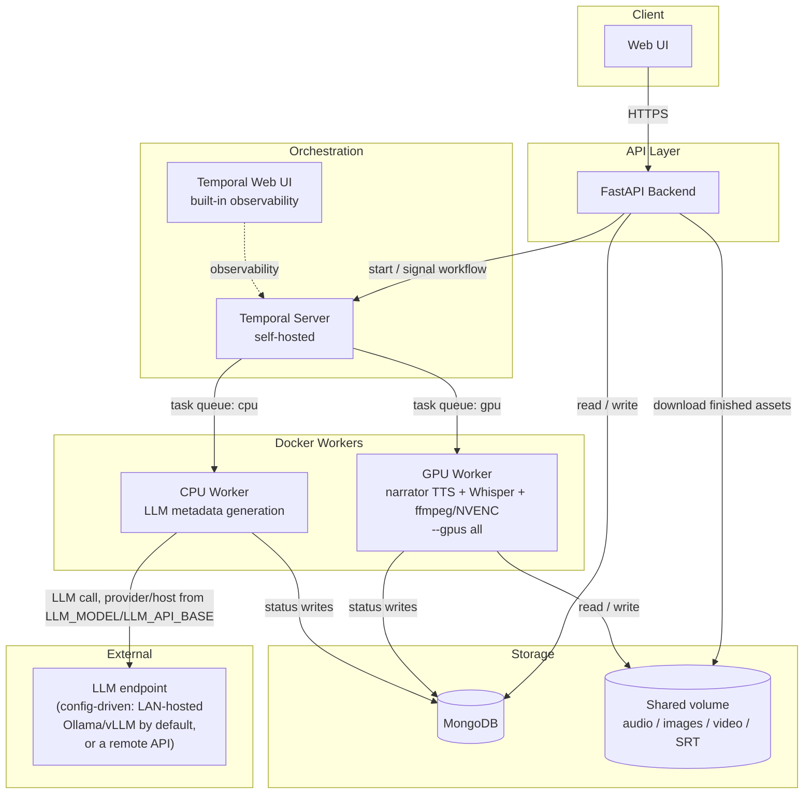
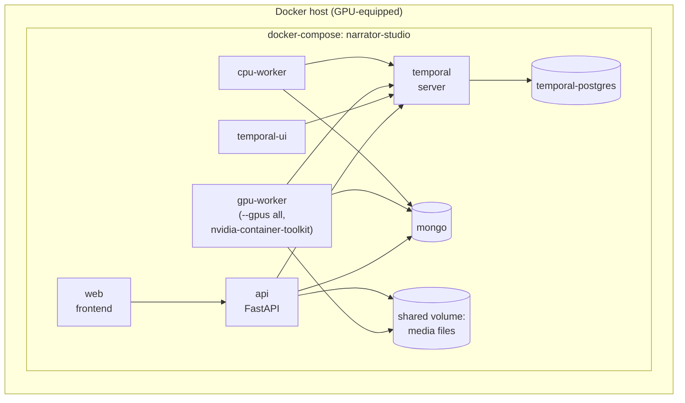
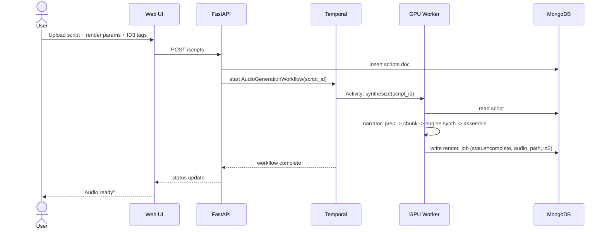
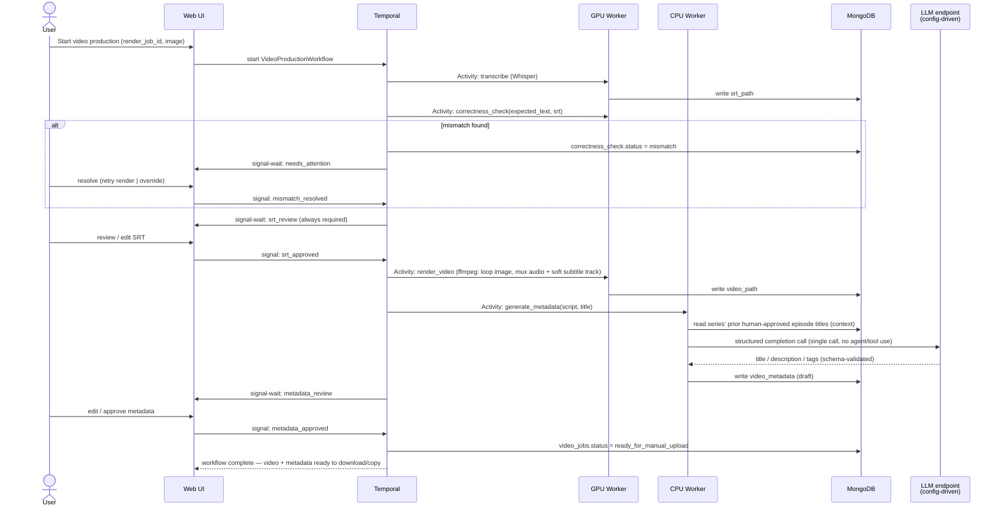
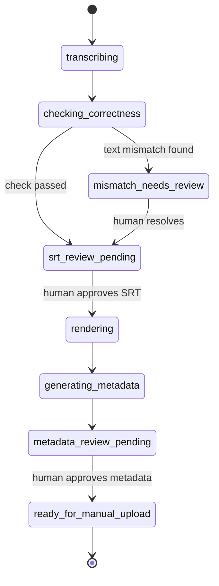

# RFC: Narrator Studio — Script-to-Video Production Pipeline

**Status:** v5 — metadata-generation LLM access genericized during Phase 3 planning
(§3, §5.1, §7.2, §9, §10, §13); all other content unchanged since v4 (§12)
**Author:** Claude, for Giovanni Fajardo
**Scope:** New system (web UI + Temporal workflows + MongoDB + Docker workers) built
around the existing `narrator` CLI/library (`src/narrator/`, this session's work)

---

## 1. Summary

`narrator` is a proven local CLI: script in, narrated MP3 out, with real voice cloning
(Chatterbox V3), correct multilingual scripture/number handling, and ID3 tagging. This
RFC proposes wrapping it in a small internal platform so that a script upload turns into
a fully-tagged MP3, then a captioned video, then a finished set of assets — video file
plus LLM-generated title/description/tags — staged in the UI for the user to upload to
YouTube themselves. A human approves every consequential step along the way. The system
never touches YouTube directly; it stops at "everything is ready for you to publish."
Runs as self-hosted Docker services orchestrated by Temporal.

## 2. Motivation

Producing one episode today means manually running CLI commands, hand-tracking which
unit/language/render-parameters were used, and manually handling transcription and video
assembly. That doesn't scale to a weekly ten-part series across three languages. This
system turns that into: upload once, get notified when each human-decision point is
ready, approve, move on — ending with a finished video and copy-paste-ready metadata,
same hand-off point as the old pipeline had, just automated up to that point.

## 3. Goals

- Web-based script upload with full ID3 tag control (parity with a standard metadata
  editor: artist, title, album, track, year, genre, comments — plus narrator's existing
  render-parameter tags).
- Durable, observable, resumable pipeline execution (Temporal) surviving worker restarts
  and GPU contention.
- A correctness check that catches TTS content problems (skipped/repeated speech) by
  comparing Whisper's transcript against the exact text narrator fed to synthesis.
- LLM-generated YouTube title/description/tags, staged for manual copy-paste — **the
  system never uploads or publishes anything itself.**
- Self-hosted on the user's own Docker-capable, GPU-equipped hardware — no new recurring
  cloud costs. Metadata generation defaults to LLM inference on the user's own home
  network (Ollama/vLLM on any of several LAN machines the user already has), so no data
  needs to leave the network at all by default; a remote API (e.g. Anthropic) remains an
  explicit, config-driven opt-in for when local copy quality proves insufficient.

## 4. Non-Goals (v1)

- Multi-tenancy / cross-team data isolation — this is one small team's internal tool.
- **Any YouTube API integration** — no OAuth, no upload, no publish, no scheduling. This
  was explicitly considered and reversed: the system's job ends at producing the finished
  video and metadata; the actual upload is a manual, off-system action.
- Rewriting narrator's synthesis internals — `src/narrator/` is treated as a stable,
  already-hardened dependency this system calls into.
- Analytics/growth tooling, comment management, or anything past "assets are ready."

## 5. System Architecture

### 5.1 Component diagram

No component ever talks to YouTube. The workflow's terminal state is "assets ready" —
the UI's job past that point is just letting the user download/copy what's there. The
"External" subgraph is a soft label, not a hard architectural boundary — by default the
LLM endpoint is another machine on the user's own home network (still "internal" in
every practical sense), not a third party; it only becomes truly external when
`LLM_MODEL` is explicitly configured to point at a remote API instead.

### 5.2 Deployment topology (Docker Compose)

Each worker type is its own Docker image/service so the GPU-bound one (needing
`nvidia-container-toolkit`) doesn't force GPU requirements onto the lightweight metadata
worker, and so task queues can scale independently. No publish worker exists — there's
nothing for it to do.

## 6. Data Model

### 6.1 Entity-relationship diagram

```mermaid
erDiagram
    USERS ||--o{ SCRIPTS : uploads
    SCRIPTS ||--o{ RENDER_JOBS : generates
    RENDER_JOBS ||--o| VIDEO_JOBS : "feeds into"
    VIDEO_JOBS ||--o| VIDEO_METADATA : produces

    USERS {
        ObjectId _id PK
        string email
        string password_hash
        string team_id
        string role
        datetime created_at
    }
    SCRIPTS {
        ObjectId _id PK
        string unit_id
        string lang
        string series_name
        string raw_text
        ObjectId uploaded_by FK
        datetime uploaded_at
    }
    RENDER_JOBS {
        ObjectId _id PK
        ObjectId script_id FK
        string engine
        string voice_family
        float cfg_weight
        float exaggeration
        float speed
        int seed
        string status
        string audio_path
        object id3
        datetime created_at
        datetime completed_at
    }
    VIDEO_JOBS {
        ObjectId _id PK
        ObjectId render_job_id FK
        string image_path
        string srt_path
        object correctness_check
        string human_review_status
        string video_path
        string status
        datetime created_at
        datetime completed_at
    }
    VIDEO_METADATA {
        ObjectId _id PK
        ObjectId video_job_id FK
        string generated_title
        string generated_description
        array generated_tags
        datetime human_approved_at
        ObjectId approved_by FK
        boolean manually_uploaded
        datetime manually_uploaded_at
    }
```

### 6.2 Collection field reference

**`users`**

| Field | Type | Notes |
|---|---|---|
| `_id` | ObjectId | |
| `email` | string | unique |
| `password_hash` | string | bcrypt/argon2 |
| `team_id` | string | single team for v1, field kept for future flexibility |
| `role` | string | `admin` \| `member` |
| `created_at` | datetime | |

**`scripts`**

| Field | Type | Notes |
|---|---|---|
| `_id` | ObjectId | |
| `unit_id` | string | matches narrator's `<unit-id>` convention |
| `lang` | string | `es` \| `en` \| `pt` |
| `series_name` | string | e.g. "1 John" |
| `raw_text` | string | the script content, as narrator expects it |
| `uploaded_by` | ObjectId → `users` | |
| `uploaded_at` | datetime | |

**`render_jobs`** — one per script render attempt

| Field | Type | Notes |
|---|---|---|
| `_id` | ObjectId | |
| `script_id` | ObjectId → `scripts` | |
| `engine` | string | `chatterbox` \| `kokoro` |
| `voice_family` | string | path/identifier, per `src/narrator/voices.py` resolution |
| `cfg_weight`, `exaggeration`, `speed` | float | passed straight to `RenderJob` |
| `seed` | int | |
| `status` | string | `queued` \| `rendering` \| `complete` \| `failed` |
| `audio_path` | string | shared-volume path to the MP3 |
| `id3` | object | `{artist, title, album, track, year, genre, comments}` — UI-editable, maps onto the tag-editor form |
| `created_at`, `completed_at` | datetime | |

**`video_jobs`** — one per video production attempt for a `render_job`

| Field | Type | Notes |
|---|---|---|
| `_id` | ObjectId | |
| `render_job_id` | ObjectId → `render_jobs` | |
| `image_path` | string | background image, shared volume |
| `srt_path` | string | |
| `correctness_check` | object | `{status: "pass"\|"mismatch", mismatches: [{expected, actual, approx_time}]}` |
| `human_review_status` | string | `pending` \| `approved` |
| `video_path` | string | final MP4 |
| `status` | string | see §7.2 state diagram |
| `created_at`, `completed_at` | datetime | |

**`video_metadata`** — one per video's generated YouTube copy

| Field | Type | Notes |
|---|---|---|
| `_id` | ObjectId | |
| `video_job_id` | ObjectId → `video_jobs` | |
| `generated_title`, `generated_description` | string | LLM output, human-editable before approval |
| `generated_tags` | array\<string\> | |
| `human_approved_at` | datetime | when the user finished reviewing/editing the copy |
| `approved_by` | ObjectId → `users` | |
| `manually_uploaded` | boolean | user-toggled checkbox in the UI, purely for the user's own tracking — no API call behind it |
| `manually_uploaded_at` | datetime | set when the checkbox above is ticked |

No YouTube video ID, visibility, or publish-status fields — the system never uploads
anything, so there's nothing to track on YouTube's side. `manually_uploaded` exists only
so the dashboard can show "which episodes have I already put up," set by hand.

## 7. Workflows

### 7.1 `AudioGenerationWorkflow`

Maps directly onto existing code: the Activity body is essentially
`src/narrator/batch.py::render_job()`, called with a `RenderJob` built from the UI form
fields instead of CLI args.

### 7.2 `VideoProductionWorkflow`

Workflow ends at metadata approval. There is no publish step, no OAuth, no upload
Activity — the user takes the finished MP4 and the approved title/description/tags from
the UI and uploads to YouTube themselves, exactly as the old pipeline's manual hand-off
worked, just with the metadata now generated instead of hand-authored.

`generate_metadata` is a single deterministic Temporal Activity, not an agent — no
tool use, no multi-step reasoning, no autonomous retries beyond Temporal's own bounded
`RetryPolicy`. It pre-fetches context (prior human-approved episode titles in the same
`series_name`, for consistency) before making one structured LLM call. The LLM
provider and target machine are both config-driven (`LLM_MODEL`, `LLM_API_BASE`) —
defaulting to an Ollama- or vLLM-served model on one of the user's own LAN machines,
with a remote API (e.g. Anthropic, via `ANTHROPIC_API_KEY`) available as an explicit
opt-in override, not the default. See §10 and §13 for the harness's technology choice
and rationale.

### 7.3 `video_jobs.status` state machine

`ready_for_manual_upload` is a terminal state, not a queue waiting on further system
action — the dashboard can optionally flip `manually_uploaded` later (see §6.2) purely
for the user's own tracking, but nothing in the workflow depends on that happening.

The correctness check compares **exact text** — the ground truth is the same
prepared/chunked text narrator already fed to TTS (re-derivable deterministically via
`prepare()` + `chunk_prepared_script()` on the stored `raw_text`, no new sidecar file
needed), not a fuzzy LLM judgment. The known risk here is *timeline* accuracy, not
content drift — Whisper must transcribe the **final assembled** audio (post-concatenation,
post-`speed` adjustment), not individual pre-assembly chunks, or SRT timestamps will
drift out of sync with the actual video.

## 8. Human-in-the-Loop Design

Every point below is a Temporal signal-wait, surfaced in the UI as a "needs your
attention" queue (not buried in workflow history):

1. **Correctness-check mismatch** — halts; human retries the render or explicitly
   overrides.
2. **SRT review** — always required, regardless of check outcome; human reads/edits the
   transcript before it becomes captions.
3. **Metadata review** — human edits/approves LLM-generated title/description/tags. This
   is the workflow's last step — once approved, the video and metadata just sit in the
   UI, finished, waiting for the user to manually upload to YouTube on their own time.

There is deliberately no publish-approval gate, because there is no publish action for
one to gate — that whole step was considered and explicitly removed (see §13).

## 9. Security & Secrets

- **`LLM_MODEL`, `LLM_API_BASE`**: plain config (not secrets) selecting the LLM
  provider and target machine for metadata generation — e.g. `LLM_MODEL=ollama/
  llama3.1:8b` with `LLM_API_BASE=http://<lan-ip>:11434` for a LAN-hosted Ollama
  machine, or `hosted_vllm/<model>` with a vLLM host's `/v1` endpoint. Defaults to a
  LAN-hosted model, no third-party dependency.
- **`ANTHROPIC_API_KEY`**: Docker secret / `.env` excluded from any image build
  context — **only required when `LLM_MODEL` is explicitly configured to select a
  remote provider** (e.g. `anthropic/claude-...`). Not required, and not read, when
  using the LAN-hosted default. When it is in use, it's the system's only outbound
  network dependency to a third party.
- **Auth**: session or JWT-based, `users` collection, bcrypt/argon2 password hashing.
  No external identity provider needed at this scale.
- **Network**: API/UI exposed only on the local network (or behind a VPN/reverse proxy
  the user already controls) — not a public internet-facing service, since this is an
  internal team tool.

## 10. Technology Stack

| Layer | Choice | Rationale |
|---|---|---|
| Backend/API | FastAPI (Python) | Natural fit — narrator is already Python, Temporal's Python SDK (`temporalio`) is first-class. |
| Frontend | **React 19 + Vite**, plain JavaScript (ES Modules, no TypeScript), inline CSS-in-JS with a shared color-token system | Matches `/home/geo/develop/projects/ebpi` (the user's other trilingual Bible project) — same conventions, same stack, no new tooling to learn or maintain. |
| Workflow engine | Temporal, self-hosted via Docker Compose | Durable execution + native signal/query primitives, which map directly onto "pause and wait for a human." |
| Database | MongoDB (Motor async driver), self-hosted via Docker | Per confirmed direction — Docker-hosted, not managed cloud. |
| Auth | Lightweight session/JWT against the `users` collection | Small internal team, no external identity provider needed. |
| Video captions | **Soft subtitle track** (muxed, not burned in) | Confirmed — fixes the old pipeline's noted gap: toggleable, reusable as YouTube's native caption track when uploaded, rather than baked pixels. Changes the render Activity's ffmpeg invocation from the old `subtitles=` filter to muxing an `mov_text`/`srt` stream alongside video+audio. |
| LLM access (metadata generation) | **LiteLLM**, one function-call abstraction (`litellm.acompletion(model=..., ...)`), model/provider selected via config (`LLM_MODEL`/`LLM_API_BASE`), local-network-first default | Not an agent framework (rejected Pydantic AI specifically because its core primitive is literally named `Agent` — this task is a single structured completion, not tool use/multi-step reasoning). Not a hand-rolled adapter either — reimplementing per-provider JSON-schema-constrained-decoding wire formats (Ollama's `format`, vLLM's `guided_json`/OpenAI-style `response_format`, Anthropic's own tool-forcing trick) is a solved problem. LiteLLM covers Ollama, vLLM (`hosted_vllm/*`), and Anthropic through the same call shape — swapping the model string is the entire provider-switch surface. |

### 10.1 Observability & Live Progress

Confirmed: the goal is the **web UI itself** showing live pipeline progress — not
sending the user to Temporal's separate Web UI to check on things. Design:

- **Live status push, not polling.** Every activity already writes a status transition
  to MongoDB (`render_jobs.status`, `video_jobs.status`) as it progresses. The API
  watches these via a **MongoDB change stream** and pushes updates to connected UI
  clients over **Server-Sent Events (SSE)** (simpler than WebSocket for one-directional
  server→client updates, and this is one-directional — the UI signals Temporal through
  normal POST requests, it doesn't need a bidirectional channel). The dashboard and any
  open "needs your attention" item update in real time with no manual refresh.
- **Structured logging.** Workers and the API emit JSON logs (not plain text) with
  consistent fields — `workflow_id`, `job_id`, `stage`, `status`, `duration_ms`,
  `timestamp` — to stdout, captured by Docker's own logging driver. Cheap, always worth
  doing, and enough on its own for a small-team tool to `docker compose logs -f | jq` when
  debugging a specific job. No log-aggregation service (Loki, etc.) in v1 — revisit only
  if searching raw JSON logs across containers actually becomes painful in practice.
- **Metrics.** Temporal's Python SDK and server both export Prometheus metrics natively —
  enable this from day one (task-queue depth, activity latency/failure counts, workflow
  completion rates) since it's close to free to turn on, even before anything visualizes
  it. No Grafana/Prometheus-server deployment in v1 either — the UI's own dashboard,
  built from MongoDB aggregation queries (counts per pipeline stage, recent failures,
  average time-in-stage), covers the actual stated need ("monitor progress in our UI").
  Standing up a full metrics-visualization stack is deferred until the lighter approach
  proves insufficient.
- **Dashboard view** (new UI surface, beyond the per-episode "needs your attention"
  queue from §8): counts of episodes per `video_jobs.status` value, a recent-activity
  feed, and surfacing anything in a failed/stuck state — all served by one API endpoint
  aggregating MongoDB, refreshed live via the same SSE channel.

## 11. Reused From `narrator` (this session's work)

| Component | File | Reused as |
|---|---|---|
| Render orchestration | `src/narrator/batch.py` (`RenderJob`, `render_job()`) | Body of the `synthesize` Activity |
| Text prep + scripture/number expansion | `src/narrator/prep/` | Unchanged; also re-run to derive correctness-check ground truth |
| Chunking | `src/narrator/chunk.py` | Unchanged; also used for ground truth |
| Engines | `src/narrator/engines/chatterbox.py`, `kokoro.py` | Unchanged — V3 model, real voice cloning |
| Assembly + ID3 tagging | `src/narrator/assemble.py` | Extend `tag_mp3()` for `year`/`genre`/`comments` (TDRC/TCON/COMM frames) — not yet written, needed for tag-editor parity |
| Voice resolution | `src/narrator/voices.py` | Unchanged |

## 12. Open Questions — All Resolved

No open questions remain. Summary of what was decided during review:

- **Subtitle burn-in vs. soft track** → soft track (§10).
- **Frontend framework** → React 19 + Vite, plain JS, matching `ebpi` (§10).
- **GPU passthrough readiness** → confirmed ready; `/etc/docker/daemon.json` already sets
  `nvidia` as the default runtime, and a private registry
  (`docker-registry.mixwarecs-home.net:5000`) is available for worker images (§14).
- **Observability beyond Temporal's built-in Web UI** → yes, structured logging +
  Temporal's native Prometheus metrics, specifically so the system's own UI can show live
  pipeline progress via MongoDB change streams + SSE, rather than sending the user to a
  separate dashboard (§10.1).

This RFC is ready to move to an implementation plan.

## 13. Alternatives Considered

- **Celery/Redis instead of Temporal** — simpler to stand up, but loses Temporal's
  durable-execution guarantees (workflow state survives worker crashes) and native
  signal/query primitives, which map unusually well onto "pause and wait for a human"
  — the core requirement here. Rejected.
- **Cloud-managed Temporal/Mongo** — rejected per explicit direction: self-hosted Docker,
  no recurring cloud cost, GPU work stays on local hardware regardless.
- **Real YouTube API publishing (with a human approval gate)** — this was the initial
  direction and was fully designed (OAuth, publish worker, publish-approval signal,
  default-private-then-make-public safety layer) before being explicitly reversed: even a
  gated automated publish is more surface (credentials, quota, a real API call that goes
  live somewhere) than the actual need, which is just having finished assets ready for a
  human to upload by hand. Rejected in favor of the system stopping at "assets ready."
- **LLM-based fuzzy correctness check** — considered, rejected in favor of exact-text
  comparison: the ground truth is fully known (narrator's own prepared text), so fuzzy
  semantic judgment would only add cost/latency without adding accuracy; the real risk
  identified is timing sync, not content ambiguity.
- **Anthropic API as the only metadata-generation provider** — this was v1-v3's design
  (§3, §5.1, §9 as originally written), reconsidered once it became clear the user
  already has several machines on their home network capable of running Ollama or
  vLLM — using one of those by default closes the RFC's own stated goal of no data
  leaving the network at all, not just "except one deliberate call." Rejected as the
  *only* option, not dropped entirely: a remote API (Anthropic or otherwise) remains
  available as a config-driven opt-in for when local copy quality doesn't hold up, via
  the same `LLM_MODEL`/`LLM_API_BASE` mechanism (§9, §10).
- **Pydantic AI as the LLM abstraction layer** — also multi-provider (`Agent("ollama:
  llama3.2")`, `Agent("anthropic:claude-...")`) with typed structured output, and was
  considered alongside LiteLLM. Rejected specifically because its core primitive is
  named `Agent` and it's positioned as an agent framework (dependency injection, tool
  orchestration) — conceptually the wrong shape for a task that's explicitly one
  deterministic completion call with pre-fetched context, not agentic behavior, even
  though it could technically be used tool-free. LiteLLM has no such framing.
- **A hand-rolled per-provider LLM adapter** — tempting given this project's general
  bias toward direct code over abstraction, but each provider's JSON-schema-
  constrained-decoding wire format genuinely differs (Ollama's native `format` field,
  vLLM's OpenAI-compatible `response_format`/`guided_json`, Anthropic's forced-tool-use
  trick) — reimplementing that per provider is a solved problem, not a premature
  abstraction to reach for a small, well-scoped library (LiteLLM) instead.

## 14. Proposed Rollout (phased, for after this RFC is settled)

1. Docker Compose skeleton: Temporal + Mongo + Temporal UI, no application code yet —
   prove the infra boots and is reachable, GPU worker container gets device access via
   the host's existing `nvidia` default runtime, worker images push to the existing
   private registry (`docker-registry.mixwarecs-home.net:5000`).
2. `AudioGenerationWorkflow` + minimal UI (upload script, set tags, trigger render, see
   status) — narrator's existing pipeline wrapped, nothing new pipeline-wise.
3. `VideoProductionWorkflow` stages one at a time: transcription → correctness check →
   SRT review UI → video render → metadata generation → metadata review UI. Workflow
   ends there — no further stages.
4. Hardening pass: secrets management, error/retry policy tuning, worker resource limits.

---

*All open questions resolved as of v4 (§12) — this document is settled and ready to
become an implementation plan. Further changes only if something surfaces during that
next pass.*

*v5: exactly that happened — Phase 3 planning surfaced that the user already has
several LAN machines capable of running Ollama/vLLM, so the metadata-generation LLM
call (previously hardcoded to the Anthropic API) was genericized to a config-driven
provider/target, defaulting to local-network inference. See §13 for the full
rationale.*
